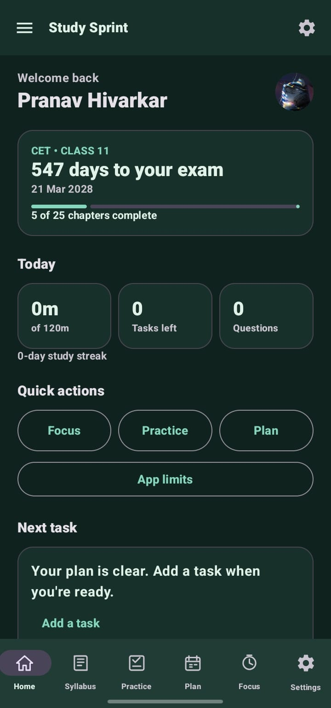
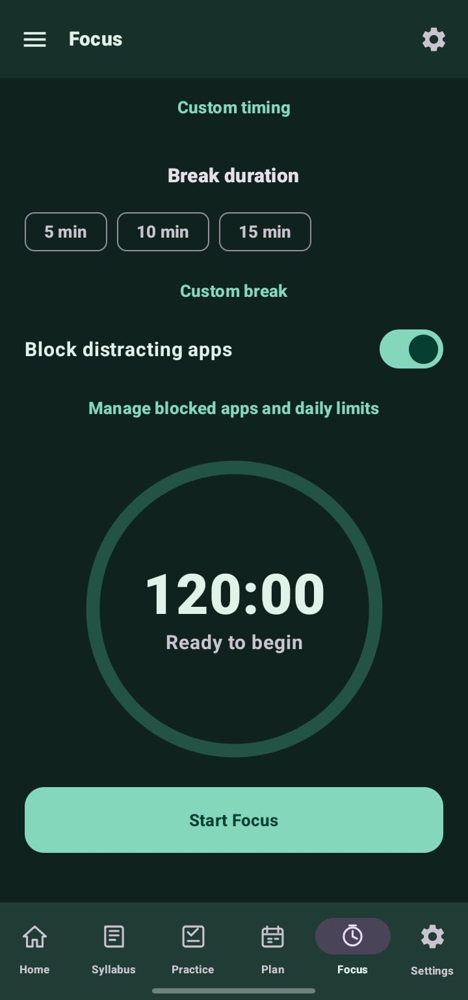
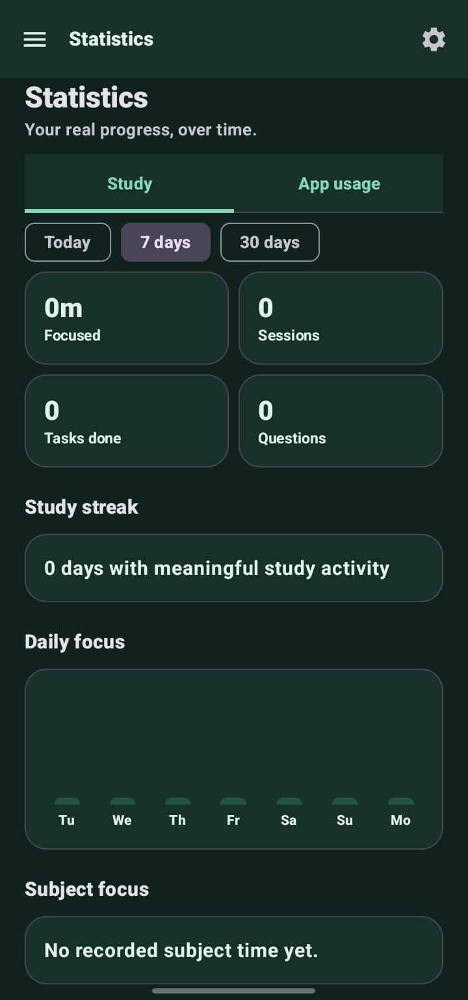
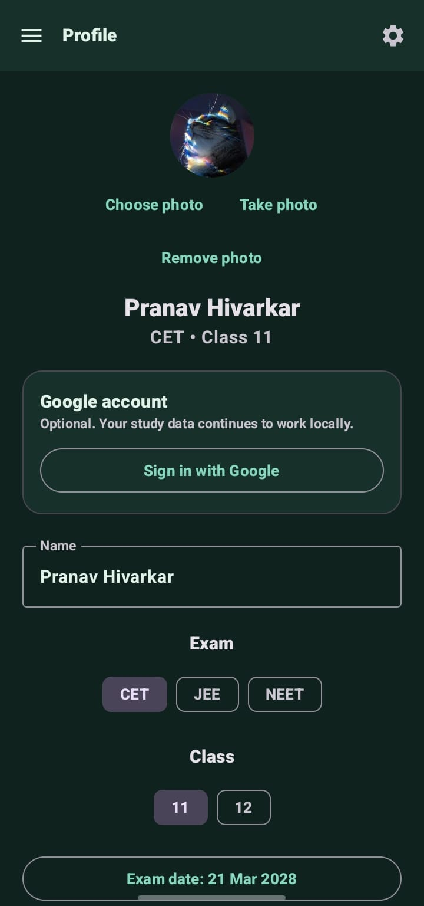
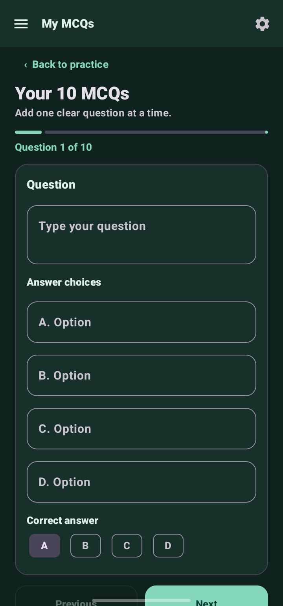
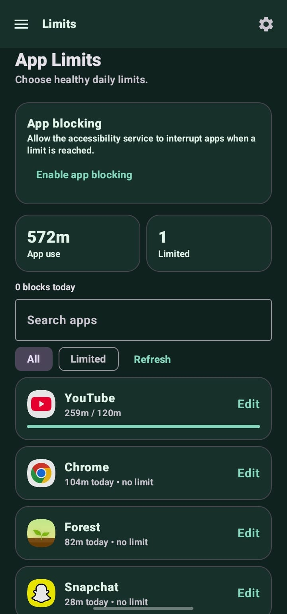

<div align="center">
  

# Study Sprint

**A focused Android study companion for MHT-CET, JEE, NEET and HSC/NCERT preparation.**

[](https://github.com/coder-heaven/Study-Sprint/releases/latest)


[](LICENSE)

[Download the latest APK](https://github.com/coder-heaven/Study-Sprint/releases/latest)

</div>

## What’s new in v1.2.0

- Blue and indigo Material 3 interface inspired by the login design
- High-contrast navy dark mode with improved cards, text and navigation
- Blue gradient exam-progress card on the home screen
- Automatic GitHub update checks with direct APK download
- Guided setup for Android app-limit permissions
- Custom notification times, PDF MCQ import and local-midnight limit resets
- AI-assisted MCQ creation with optional file sharing and a ready-made import prompt

## Features

### Study planning

- CET, JEE and NEET study paths
- Class 11 and Class 12 profiles
- HSC syllabus tracking for CET and NCERT chapter planning for JEE/NEET
- Selectable chapter completion and progress summaries
- Editable examination date and daily focus target
- Daily planner and “What I learned today” journal
- Custom-time study and planning reminders

### Practice

- Original concept, critical-thinking and competency MCQs
- Personal editor for sets of 10 MCQs
- Open any compatible installed AI app with the correct Study Sprint prompt
- Share up to five notes, PDFs or other study files with the AI app
- Import up to 10 questions from a text-based PDF
- Arihant practice logging
- Question progress, scoring, answers and explanations

### Focus and wellbeing

- Custom focus and break durations
- Pomodoro-style focus sessions
- Study and focus history
- App-usage statistics
- Per-app daily limits with selectable weekdays
- Optional app blocking during limits or focus sessions
- Limits automatically reset at local midnight

### Account and appearance

- Google sign-in through Firebase Authentication
- Guest mode with local-only study data
- Editable profile, course, class, photo and examination date
- Light, dark and system appearance modes
- GitHub release update notifications

## Screenshots

| Home | Focus | Statistics |
|:---:|:---:|:---:|
|  |  |  |

| Profile | MCQ editor | App limits |
|:---:|:---:|:---:|
|  |  |  |

> The interface continues to evolve. Screenshots may vary slightly from the newest release.

## PDF question format

PDF import works with text-based PDFs up to 20 MB and reads up to the first 30 pages. Scanned-image PDFs require OCR before importing.

```text
1. What is the SI unit of force?
A. Joule
B. Newton
C. Watt
D. Pascal
Answer: B

2. Water freezes at:
A. 0 °C
B. 10 °C
C. 50 °C
D. 100 °C

Answer Key: 1-B, 2-A
```

Questions should be numbered and contain four options labelled A–D. Answers can appear after each question or in a numbered answer key.

### Create the PDF with an AI app

From **Practice → Your own 10 MCQs**, choose one of these options:

1. **Open an AI app** copies and shares the Study Sprint prompt. Attach the source files inside your preferred AI app.
2. **Choose files and open AI** selects up to five files first, then sends the files and prompt through Android's share sheet.
3. Ask the AI app to export or print its result as a text-based PDF.
4. Return to Study Sprint and select **Import questions from PDF**.

Android shows all compatible installed apps in the share sheet. Support for receiving shared files varies between AI apps, so the prompt is also copied to the clipboard as a fallback.

## Requirements

- Android Studio
- JDK 17
- Android SDK 35
- Android 8.0 or newer
- A Firebase Android app using package name `com.pranav.study.cet_study_sprint`

## Firebase setup

1. Create or select a Firebase project.
2. Add an Android app with package name `com.pranav.study.cet_study_sprint`.
3. Add the SHA-1 fingerprint for the key used to sign the APK.
4. Enable **Authentication → Sign-in method → Google**.
5. Download the updated `google-services.json`.
6. Place it at `app/google-services.json`.

The real Firebase configuration is intentionally ignored by Git. The repository includes `app/google-services.example.json` to document the expected location and structure.

## Build

From the repository root on Windows:

```powershell
.\gradlew.bat :app:testDebugUnitTest :app:lintDebug
.\gradlew.bat :app:assembleRelease
```

The release APK is generated under:

```text
../build/app/outputs/apk/release/app-release.apk
```

## App-limit permissions

Usage tracking and automatic blocking use two separate Android permissions:

1. **Usage Access** lets Study Sprint calculate each app’s foreground time.
2. **Accessibility** lets Study Sprint detect the opened app and return from it after a configured limit is reached.

The Accessibility service does not request access to retrieve window content. Blocking is optional; planning, focus, practice and limit tracking remain available without it.

On Android 13 and newer, APKs installed from GitHub may require:

1. Open **Settings → Apps → Study Sprint**.
2. Open the three-dot menu.
3. Select **Allow restricted settings**.
4. Return to Accessibility and enable **Study Sprint app limits**.

This is an Android safety requirement for sideloaded apps and cannot be bypassed by application code. Only enable sensitive permissions for an APK you trust.

## GitHub update system

Study Sprint checks the repository’s latest published release periodically. To make an update appear inside the app:

1. Increase `versionCode` and `versionName`.
2. Create a higher semantic-version tag, such as `v1.2.1`.
3. Publish it as a GitHub Release—not only a Git tag.
4. Attach the APK as a release asset.

The app downloads only from an HTTPS `github.com` URL. If a release has no APK asset, the release page is opened instead.

## Data and privacy

- Study plans, history, MCQs, limits and profile settings are stored locally.
- Google sign-in identifies the account but cloud study-data sync is not currently enabled.
- The GitHub update check sends a standard request to GitHub’s public releases API.
- No advertising SDK is included.

## Release signing

The current local test release configuration uses the debug signing key. Before publishing to Google Play or distributing long-term production updates:

- Create and securely back up a private release keystore.
- Keep the keystore and passwords outside Git.
- Continue signing every update with the same key.
- Update Firebase SHA fingerprints for the production key.

Changing signing keys prevents an APK from updating an existing installation unless a supported signing-key migration is used.

## Technology

- Kotlin
- Jetpack Compose
- Material 3
- Firebase Authentication
- Credential Manager
- PdfBox-Android
- Android UsageStats and Accessibility APIs

## License

Study Sprint is released under the [MIT License](LICENSE).
